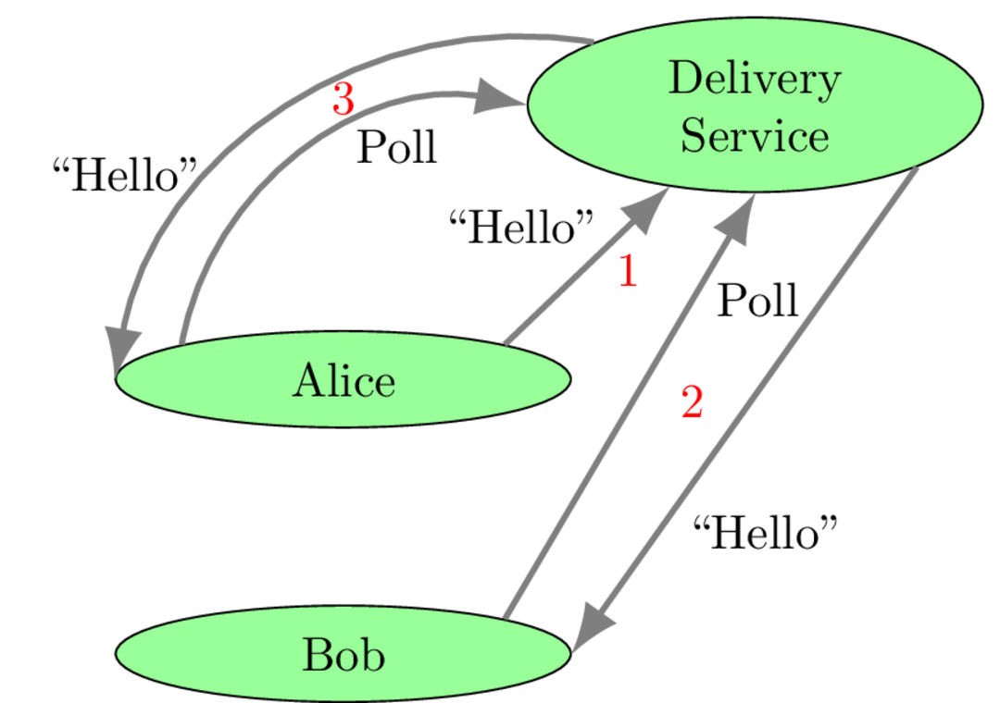
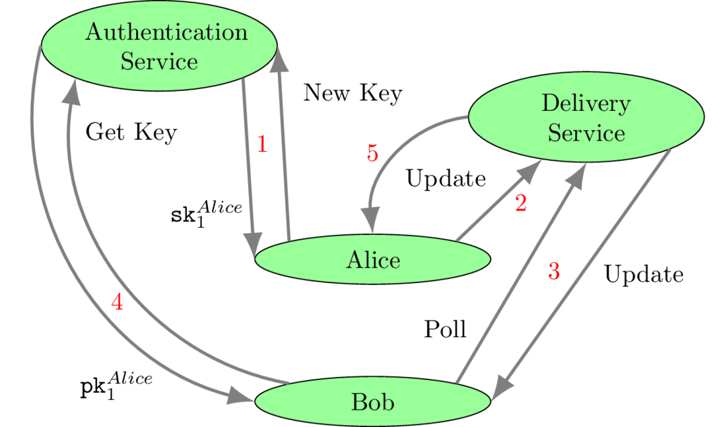
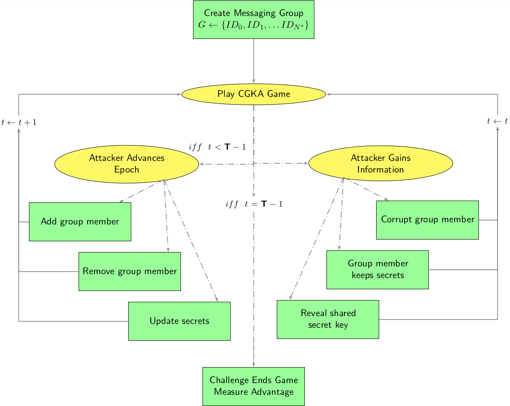

# Introduction {.s}


## Motivation

:::::::::::::: {.columns align=center}

::: {.column width="60%"}
Why bother messaging securely?

- Best practice

- Journalism [^1]

- Health care [^2]
::::

::: {.column width="40%"}
{ height=150px }
{ height=150px } \

{ height=150px }
{ height=150px } \
::::

::::::::::::::

[^1]: [@crete2020information]
[^2]: [@kuo2016secure]


## Motivation

:::::::::::::: {.columns align=center}

::: {.column width="60%"}
Why verify messaging securely? 

- Improve confidence

- Prevent vulnerabilities [^3]

- Reduce cost [^4]
::::

::: {.column width="40%"}
{ height=300px } \
::::

::::::::::::::
[^3]: [@ghafoor2014analysis]
[^4]: [@janze2017intruder]


## Secure Messaging

:::::::::::::: {.columns align=top}

::: {.column width="60%"}
A modern view

  - Authentication

  - Delivery
::::

::: {.column width="40%"}
{ width=100% } \
::::

::::::::::::::


## Secure Messaging

:::::::::::::: {.columns align=top}

::: {.column width="60%" align=top}
Broadcasting:

  1. Alice transmits "Hello"
  2. Bob polls the Delivery Service,  
    receiving "Hello" as a new message
  3. Alice polls the Delivery Service,  
    receiving "Hello" as a delivery acknolwedgement
::::

::: {.column width="40%"}
{ width=100% } \
::::

::::::::::::::


## Secure Messaging
:::::::::::::: {.columns align=top}
::: {.column width="60%" align=top}
Updating keys:

  1. Alice contacts the Authentication Service,  
    requesting a new public/secret key pair
  2. Alice transmits an Update instruction,  
    using their new key
  3. Bob polls the Delivery Service,  
    receiving Update instructions
  4. Bob queries the Authentication Service,  
    receiving Alice's new public key
  5. Alice polls the Delivery Service,  
    receiving Update instructions as a delivery acknolwedgement
::::

::: {.column width="40%"}
{ width=100% } \
::::
::::::::::::::


## Secure Messaging
:::::::::::::: {.columns .s align=top}
::: {.column width="40%" align=center}
Communication Epochs

  - Updating keys transitions  
  to next epoch
::::

::: {.column width="60%" .s align=center}
{ width=100% } \
::::
::::::::::::::


## Secure Messaging
:::::::::::::: {.columns align=center}
::: {.column width="40%"}
**Forward secrecy:**  

If the state of either member is leaked to an adversary during epoch $t$,
all previous communication epochs before $t$ remain confidential from the adversary.
::::

::: {.column width="60%" align=center}
{ width=100% } \
::::
::::::::::::::


## Secure Messaging

:::::::::::::: {.columns align=top}
::: {.column width="40%"}
**Post-compromise security**  

After the member whose state was leaked during epoch $t$ performs an update,
and that update is processed by the other member,
communication after epoch $t$ becomes confidential from the adversary.
::::

::: {.column width="60%"}
{ width=100% } \
::::
::::::::::::::


## Secure Messaging
:::::::::::::: {.columns .s align=top}
::: {.column width="60%" align=center}
What does secure messaging offer?

  - Asynchronicity

  - End-to-end encryption

  - Message and data authentication

  - Forward secrecy [^5]

  - Post-compromise security [^6]
::::

::: {.column width="40%" .s align=center}
{ width=100% } \
::::
::::::::::::::
[^5]: [@unger2015sok]
[^6]: [@cohn2016post]


## Secure *Group* Messaging
:::::::::::::: {.columns .s align=top}
::: {.column width="60%" align=center}
What does secure *group* messaging offer?

  - Asynchronicity

  - End-to-end encryption

  - Message and data authentication

  - Forward secrecy with updates [^7]

  - Post-compromise security [^8]
::::

::: {.column width="40%" .s align=center}
{ width=100% } \
::::
::::::::::::::
[^7]: [@alwen2020security]
[^8]: [@ietf-mls-protocol-14]


## Secure *Group* Messaging
:::::::::::::: {.columns .s align=top}
::: {.column width="60%" align=center}
New considerations:

  - Adding a new member to the group

  - Removing an existing member from the group

  - Know when *all* members receive a sent message

  - Do each of these securely

  - Do each of these efficiently
::::

::: {.column width="40%" .s align=center}
{ width=100% } \
::::
::::::::::::::

## Secure *Group* Messaging
:::::::::::::: {.columns .s align=top}
::: {.column width="60%" align=center}
**Forward secrecy *with Updates* (FSU):**  

If the state of *any* member is leaked to an adversary during epoch $t$,
all previous communication epochs before $t$ remain confidential from the adversary.
::::

::: {.column width="40%" .s align=center}
{ width=100% } \
::::
::::::::::::::


## Secure *Group* Messaging
:::::::::::::: {.columns .s align=top}
::: {.column width="60%" align=center}
**Post-compromise security (PCS):**  

After *every* member whose state was leaked performs an update,
and those updates are processed by *all* other members in epoch $t$,
communication after epoch $t$ becomes confidential from the adversary.
::::

::: {.column width="40%" .s align=center}
{ width=100% } \
::::
::::::::::::::


## TreeKEM Protocol [^9]
:::::::::::::: {.columns .s align=top}
::: {.column width="40%" align=center}
Supports dynamic groups

  - Adding & removing members

Tree-based updates

  - Facilatates efficient updates
::::

::: {.column width="60%" .s align=center}
{ width=100% } \
::::
::::::::::::::
[^9]: [@bhargavan:hal-02425247]


## TreeKEM Protocol
:::::::::::::: {.columns .s align=top}
::: {.column width="40%" align=center}
User $V_{0}$ initiates an update

  - Direct path to root is updated

Users of subtree $V_{i}$ process

  - Propogate changes  
  from $V_{i}$ to leaf

Users maintain root agreement

  - Each user knows *shared* root information again after processing algorithm finishes
::::

::: {.column width="60%" .s align=center}
{ width=100% } \
::::
::::::::::::::


## TreeKEM Protocol
:::::::::::::: {.columns .s align=top}
::: {.column width="40%" align=center}
User $V_{0}$ initiates an update

  - $\mathcal{O}(\log n)$ Control message size

Users of subtree $V_{i}$ process

  - $\mathcal{O}(\log n)$ Changes from $V_{i}$

Users maintain root agreement

  - $\mathcal{O}(\log n)$ Time for new epoch
::::

::: {.column width="60%" .s align=center}
{ width=100% } \
::::
::::::::::::::


## TreeKEM Protocol

**Goal:**

> Verify FSU & PCS properties of TreeKEM


## TreeKEM Protocol

Very specific, lots of details

Absraction?


## Continuous Group Key Agreement

> `CGKA` [^7] = (*init*, *create*, *add*, *rem*, *upd*, *proc*)

:::::::::::::: {.columns .s align=top}
::: {.column width="50%" align=center}
  - *init*   $: ID \to \Gamma$  
  Given an $ID$, outputs initial state $\gamma$.

  - *create* $: \Gamma \times \overrightarrow{ID} \to (\Gamma, W)$  
  From state $\gamma$ and list of $ID$s, outputs new state $\gamma'$ and control message $w$.

  - *add*    $: \Gamma \times ID \to (\Gamma, W, U)$  
  From state $\gamma$ and $ID$, outputs new state $\gamma'$, control message $w$ and control message $u$.
::::

::: {.column width="50%" .s align=center}
  - *rem*    $: \Gamma \times ID \to (\Gamma, U)$  
  From state $\Gamma$ and $ID$, outputs new state $\gamma'$ and a control message $u$.

  - *upd*    $: \Gamma \to (\Gamma, U)$  
  From state $\gamma$, outputs new state $\gamma'$ and control message $u$.

  - *proc*   $: \Gamma \times U \to (\Gamma, I)$  
  From state $\gamma$ and control message $u$, outputs new state $\gamma'$ and update secret $I$.
::::
::::::::::::::


## Continuous Group Key Agreement

{ height=90% }  
[@alwen2020security]


## Continuous Group Key Agreement

**Security Game Concepts**

$(T, C, N)$ parameterizes an adversary $\mathcal{A}$

  - $T \in \left[1, \infty \right]$  
  Limit protocol epochs

  - $C \in \left[0, T \right]$  
  Limit $\mathcal{A}$ challenge queries

  - $N \in \left[2, \infty \right]$  
  Limit of total unique group members


## Continuous Group Key Agreement

**Security Game Concepts**

The advantage demonstrated by $\mathcal{A}$ is defined as,
$$ \normalfont{\textbf{Adv}}\left\{\mathtt{CGKA}\right\}(\mathcal{A})  = \left|\; \Pr\left[ \,\mathcal{A}\text{ wins}\, \right] - \frac{1}{2} \;\right| $$

> Non-adaptive $(T, C, N, \epsilon)$ CGKA Security

A `CGKA` protocol is said to be secure if and only if for all $(T, C, N)$-adversaries $\mathcal{A}$,
$$ \normalfont\textbf{Adv}\left\{\mathtt{CGKA}\right\}(\mathcal{A}) \leq \epsilon $$


## Continuous Group Key Agreement

- Use the `CGKA` abstraction

- Model the `CGKA` security game and TreeKEM protocol via `CGKA`

- Verify FSU & PCS properies of model


# Methodology


## Verification Hypotheses
:::::::::::::: {.columns .s align=top}
::: {.column width="65%" align=center}
  - Original TreeKEM protocol has FSU deficiency [^7]

  - Corrected TreeKEM protocol should provide FSU
::::

::: {.column width="35%" .s align=center}
{ width=100% } \
::::
::::::::::::::


## Explicit State Model Checking

  - Enumerate every possible protocol state

  - Enumerate all transitions between states

  - Define the desired protocol property in terms of state attributes

  - Traverse entire state-space, ensuring the desired propery holds for every state


## Explicit State Model Checking
:::::::::::::: {.columns .s align=top}
::: {.column width="50%" align=center}
**Pros:**

  - Strong verification result,  
  no false positives

  - Verification failure produces a counter-example
::::

::: {.column width="50%" .s align=center}
**Cons:**

  - State-space explosion

  - Long verification time

  - Limited complexity
::::
::::::::::::::


## Spin

  - Venerable explicit state model-checking tool

  - Works hard to minimize impact of cons

  - Configurable for performance tuning


## Promela
:::::::::::::: {.columns .s align=top}
::: {.column width="50%" align=center}
Protocol Meta Language (Promela) [^11]

- C-like constructs

- Nondeterminism instead of branching
::::

::: {.column width="45%" .s align=center}
```
BitVar = true;
NonNeg = 8;
// Loop ends after 
// at least 24 iterations
do
:: !BitVar && NonNeg < 32 -> 
      NonNeg = NonNeg + 1;
:: BitVar -> 
      BitVar = BitVar = false;
:: NonNeg < 32 ->
      BitVar = ~BitVar;
:: NonNeg >= 32 -> 
      break;
od
```
::::
::::::::::::::

[^11]: [@holzmann1990design]


## Promela

- Spin supports Promela

- Nondeterminism enumerates state-space

- Promela for modeling `CGKA`


## Linear Temporal Logic

LTL [^10] is a logical system for reasoning about time-based properties.

LTL possesses all the logical operators of the two-element Boolean algebra with the addition of four temporal operators:        

{ width=80% } \

[^10]: [@4567924]


## Linear Temporal Logic

- Spin supports LTL

- Global variables as logical atoms

- LTL for `CGKA` properties


# Formalization


## Exhaustiveness Limitations

1. Unique state-vector encoding 

2. State-vector’s encoding includes temporal information

3. In an unbounded `CGKA` game, no finite encoding


## Exhaustiveness Limitations

General solution: 

- Timed automata [^12] 

But...

- Spin does not support timed automata

[^12]: [@alur1994theory]


## Exhaustiveness Limitations

Specific solution: 

  - For a $(T, C, N)$ adversary $\mathcal{A}$

  - Limit $T$ and $N$ to some $T_{\max}$ and $N_{\max}$


## Exhaustiveness Strengths
:::::::::::::: {.columns .s align=top}
::: {.column width="50%" align=center}
Informal transition system for `CGKA` security game
::::

::: {.column width="50%" .s align=center}
{ width=100% } \
::::
::::::::::::::


## Exhaustiveness Strengths
:::::::::::::: {.columns .s align=top}
::: {.column width="50%" align=center}
**Idempotence **

Perform operation twice,  
Arriving in the same state
::::

::: {.column width="50%" .s align=center}
{ width=100% } \
::::
::::::::::::::


## Exhaustiveness Strengths
:::::::::::::: {.columns .s align=top}
::: {.column width="50%" align=center}
**Idempotence **

No cyclic/redundant operations

Operations progess towards end
::::

::: {.column width="50%" .s align=center}
{ width=100% } \
::::
::::::::::::::


## Exhaustiveness Strengths
:::::::::::::: {.columns .s align=top}
::: {.column width="50%" align=center}
**Member messages**

  - $\mathtt{ID_i}$ calls *add*

  - $\mathtt{ID_i}$ calls *rmv*

  - $\mathtt{ID_i}$ calls *upd*

  - $\mathcal{A}$ queries $\mathtt{add{\text-}user}$($\mathtt{ID_i}$)

  - $\mathcal{A}$ queries $\mathtt{remove{\text-}user}$($\mathtt{ID_i}$)

  - $\mathcal{A}$ queries $\mathtt{send{\text-}update}$($\mathtt{ID_i}$)

Then $\mathcal{A}$ queries $\mathtt{deliver}$($t$, $\mathtt{ID_i}$, $\mathtt{ID_{*}}$)
::::

::: {.column width="50%" .s align=center}
{ width=100% } \
::::
::::::::::::::


## Exhaustiveness Strengths
:::::::::::::: {.columns .s align=top}
::: {.column width="50%" align=center}
**Member messages**

 - $\mathcal{A}$ chooses epoch transitions
::::

::: {.column width="50%" .s align=center}
{ width=100% } \
::::
::::::::::::::


## Exhaustiveness Strengths
:::::::::::::: {.columns .s align=top}
::: {.column width="50%" align=center}
{ width=100% } \
::::

::: {.column width="50%" .s align=center}
{ width=100% } \
::::
::::::::::::::


# Results


## Verification Hypotheses
:::::::::::::: {.columns .s align=top}
::: {.column width="65%" align=center}
{ width=100% } \
::::

::: {.column width="35%" .s align=center}
**Hypotheses:**  
{ width=100% } \
::::
::::::::::::::


## Verification Hypotheses
:::::::::::::: {.columns .s align=top}
::: {.column width="65%" align=center}
{ width=100% } \
::::

::: {.column width="35%" .s align=center}
- Incomplete observation  
of verification domain

- Only 27% complete
::::
::::::::::::::


## Verification Hypotheses
:::::::::::::: {.columns .s align=top}
::: {.column width="65%" align=center}
- Observations support hypotheses

- No falsifications yet
::::

::: {.column width="35%" .s align=center}
**Hypotheses:**  
{ width=100% } \
::::
::::::::::::::


## Performance

:::::::::::::: {.columns .s align=top}
::: {.column width="40%" align=center}
- Exponential scaling

- Time-memory trade-off
::::

::: {.column width="60%" .s align=center}
{ width=100% } \
::::
::::::::::::::


## Performance

:::::::::::::: {.columns .s align=top}
::: {.column width="40%" align=center}
Spin directives

- `COLLAPSE`

- `VECTORSZ=`$X$

- `MA=`$X$ [^13]

- `SPACE`
::::

::: {.column width="60%" .s align=center}
{ width=100% } \
::::
::::::::::::::
[^13]: [@holzmann1999minimized]


## Performance

:::::::::::::: {.columns .s align=top}
::: {.column width="40%" align=center}
Spin directives

- *Three* order of magnitude memory reduction 

- Not exponential reduction

::::

::: {.column width="60%" .s align=center}
{ width=100% } \
::::
::::::::::::::
[^13]: [@holzmann1999minimized]


# Conclusion

- Model simplification via abstraction

- Time-memory tradeoff effective to an extent

- More compute time required for results


# Conclusion
:::::::::::::: {.columns .s align=top}
::: {.column width="40%" align=center}
**Thank you**

::::

::: {.column width="60%" .s align=center}
**Questions**
::::
::::::::::::::

